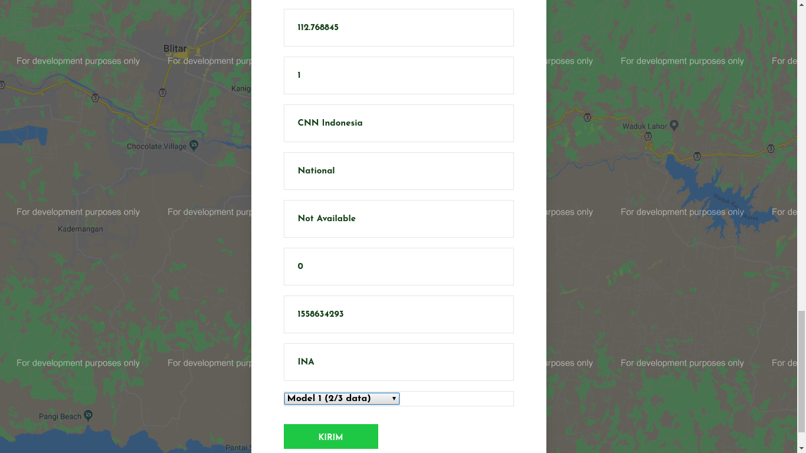
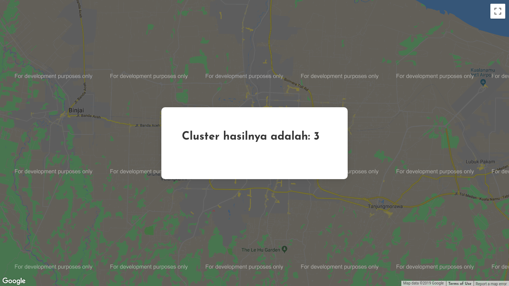

# FP Big Data Clustering
## Deskripsi Aplikasi
### [App.py](https://github.com/udinIMM/FP-Big-Data/blob/master/app.py)
`App.py` is a Flask web application that defines a RESTful-like API around the engine.

### [Engine.py](https://github.com/udinIMM/FP-Big-Data/blob/master/engine.py)
`Engine.py` defines the recommendation engine, wrapping insde all the Spark related computations.

### [Server.py](https://github.com/udinIMM/FP-Big-Data/blob/master/server.py)
`Server.py` initialises a CherryPy webserver after creating a Spark context and Flask web app using the previous.

### [Producer.py](https://github.com/udinIMM/FP-Big-Data/blob/master/producer.py)
`Producer.py` emits numbers and send them to Kafka broker

### [Consumer.py](https://github.com/udinIMM/FP-Big-Data/blob/master/consumer.py)
`Consumer.py` will read the data from the broker and store them.

## Model
1. Model 1: 1/3 data pertama.
2. Model 2: 1/3 data pertama + 1/3 data kedua.
3. Model 3: 1/3 data pertama + 1/3 data kedua + 1/3 data terakhir (semua data).

## Batas data
Batas jumlah data yang digunakan sebanyak 100.000 data per file.

## URL / End Point yang Bisa Diakses
### Menampilkan Form Input Data
Method = **[GET]**
`http://<IP_SERVER>:5432/clusterRegion` 
- Menampilkan form untuk *input* data dan pilihan model yang diinginkan.

  
### Menampilkan Hasil Cluster
Method = **[POST]**
`http://<IP_SERVER>:5432/clusterRegion` 
- Menampilkan hasil cluster sesuai dengan yang diharapkan.

## Referensi
1. https://linuxhint.com/install-apache-kafka-ubuntu/
2. https://towardsdatascience.com/kafka-python-explained-in-10-lines-of-code-800e3e07dad1
3. https://towardsdatascience.com/getting-started-with-apache-kafka-in-python-604b3250aa05

### Dibuat oleh :
#### Ilham Muhammad Misbahuddin
#### 05111540000088